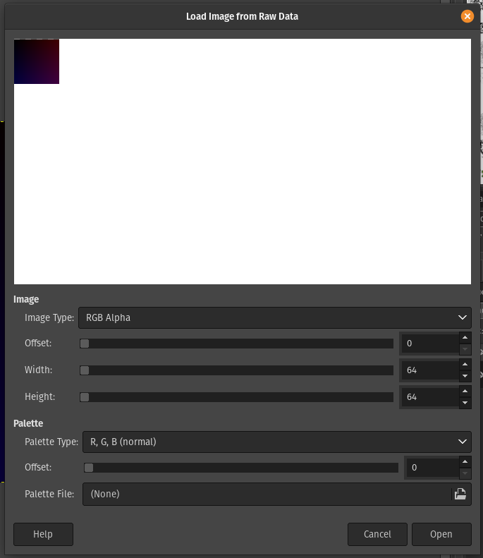
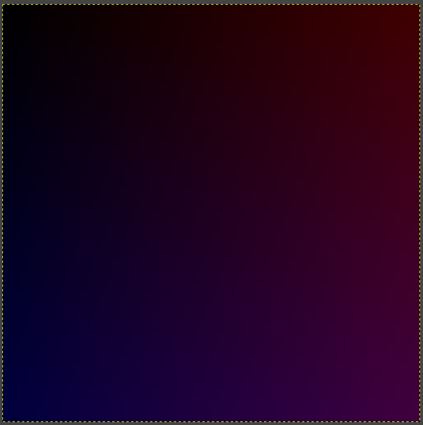

# 8086 Emulator

The Intel 8086, a 16-bit microprocessor designed in the 1970s, marked a significant development in computing technology. Its architecture and instruction set became the basis for the x86 and x86_64 architectures, which are widely used in modern CPUs. This chip played a key role in shaping the direction of microprocessor design, with its legacy evident in the evolution of current processors that expand upon its foundational concepts.

This project develops a compact emulator for the 16-bit 8086 instruction set as outlined in the Intel manual. It supports a reasonable subset of all instructions, sufficient to write moderately complex programs. For instance, the emulator is capable of executing an image-generating program.

# How to build

The project utilizes `cmake` for building, making it the only build dependency. The executables themselves have no dependencies and can be built for MacOS, Windows, and Linux.

To build the executables on Linux or Mac using gcc or clang:
```bash
git clone  https://github.com/MartinNikolovMarinov/8086-emulator.git
git submodule update --init --recursive
cd 8086-emulator
mkdir build
cd build
cmake .. --preset release
make -j
```

To build the executables on Windows using MSVC:
```bash
git clone  https://github.com/MartinNikolovMarinov/8086-emulator.git
git submodule update --init --recursive
cd 8086-emulator
mkdir build
cd build
cmake .. --preset release
cd ..
cmake --build build --config Release
```

Other preferred cmake generators should also be capable of building this project.

# Usage

Let's create a file with the following assembly code:
```asm
; example.asm

bits 16

mov ax, 1
mov bx, 2
mov cx, 3
mov dx, 4

mov sp, ax
mov bp, bx
mov si, cx
mov di, dx

mov dx, sp
mov cx, bp
mov bx, si
mov ax, di
```

Compile it down to binary using a tool like `nasm`:
```bash
nasm example.asm -o example.asm.o
```

This results in the following binary (written in hex for simplicity):
```
0xb8, 0x01, 0x00, 0xbb, 0x02, 0x00, 0xb9,
0x03, 0x00, 0xba, 0x04, 0x00, 0x89, 0xc4,
0x89, 0xdd, 0x89, 0xce, 0x89, 0xd7, 0x89,
0xe2, 0x89, 0xe9, 0x89, 0xf3, 0x89, 0xf8
```

Finally emulate the executable:
```bash
./emulator -f example.asm.o --exec --verbose
```

This produces output that shows the decoded version of the assembly code, executes and prints the result of every line, and finally displays the final register state:
```bash
bits 16

mov ax, 1
mov bx, 2
mov cx, 3
mov dx, 4
mov sp, ax
mov bp, bx
mov si, cx
mov di, dx
mov dx, sp
mov cx, bp
mov bx, si
mov ax, di

(1) mov ax, 1 ; ax:  0x0-> 0x1, ip:  0x0-> 0x3, flags: -
(2) mov bx, 2 ; bx:  0x0-> 0x2, ip:  0x3-> 0x6, flags: -
(3) mov cx, 3 ; cx:  0x0-> 0x3, ip:  0x6-> 0x9, flags: -
(4) mov dx, 4 ; dx:  0x0-> 0x4, ip:  0x9-> 0xC, flags: -
(5) mov sp, ax ; sp:  0x0-> 0x1, ip:  0xC-> 0xE, flags: -
(6) mov bp, bx ; bp:  0x0-> 0x2, ip:  0xE-> 0x10, flags: -
(7) mov si, cx ; si:  0x0-> 0x3, ip:  0x10-> 0x12, flags: -
(8) mov di, dx ; di:  0x0-> 0x4, ip:  0x12-> 0x14, flags: -
(9) mov dx, sp ; dx:  0x4-> 0x1, ip:  0x14-> 0x16, flags: -
(10) mov cx, bp ; cx:  0x3-> 0x2, ip:  0x16-> 0x18, flags: -
(11) mov bx, si ; bx:  0x2-> 0x3, ip:  0x18-> 0x1A, flags: -
(12) mov ax, di ; ax:  0x1-> 0x4, ip:  0x1A-> 0x1C, flags: -

Final Registers:
	ax: 0x000004 (4)
	bx: 0x000003 (3)
	cx: 0x000002 (2)
	dx: 0x000001 (1)
	sp: 0x000001 (1)
	bp: 0x000002 (2)
	si: 0x000003 (3)
	di: 0x000004 (4)

	es: 0x000000 (0)
	ss: 0x000000 (0)
	ds: 0x000000 (0)
	cs: 0x000000 (0)

	ip: 0x00001C (28)
	flags: - (0)
```

# Loop Example

Here's a more interesting example demonstrating a loop that adds 10 to the bx register. The loop uses the cx register as a counter, starting from 3 and iterating until cx reaches 0:
```asm
bits 16

mov cx, 3
mov bx, 1000
loop_start:
add bx, 10
sub cx, 1
jnz loop_start
```

Result after execution:
```
bits 16

mov cx, 3
mov bx, 1000
label_0:
add bx, 10
sub cx, 1
jne label_0

(1) mov cx, 3 ; cx:  0x0-> 0x3, ip:  0x0-> 0x3, flags: -
(2) mov bx, 1000 ; bx:  0x0-> 0x3E8, ip:  0x3-> 0x6, flags: -
(3) add bx, 10 ; bx:  0x3E8-> 0x3F2, ip:  0x6-> 0x9, flags: A
(4) sub cx, 1 ; cx:  0x3-> 0x2, ip:  0x9-> 0xC, flags: -
(5) jne -> ip: 0xC->0x6, flags: -
(6) add bx, 10 ; bx:  0x3F2-> 0x3FC, ip:  0x6-> 0x9, flags: P
(7) sub cx, 1 ; cx:  0x2-> 0x1, ip:  0x9-> 0xC, flags: -
(8) jne -> ip: 0xC->0x6, flags: -
(9) add bx, 10 ; bx:  0x3FC-> 0x406, ip:  0x6-> 0x9, flags: PA
(10) sub cx, 1 ; cx:  0x1-> 0x0, ip:  0x9-> 0xC, flags: PZ
(11) jne -> ip: 0xC->0xE, flags: PZ

Final Registers:
	ax: 0x000000 (0)
	bx: 0x000406 (1030)
	cx: 0x000000 (0)
	dx: 0x000000 (0)
	sp: 0x000000 (0)
	bp: 0x000000 (0)
	si: 0x000000 (0)
	di: 0x000000 (0)

	es: 0x000000 (0)
	ss: 0x000000 (0)
	ds: 0x000000 (0)
	cs: 0x000000 (0)

	ip: 0x00000E (14)
	flags: PZ (68)

```

# Image Generation Example

Here's an example demonstrating how to generate a 64x64 image using assembly language:

```asm
bits 16

; Start image after one row, to avoid overwriting our code!
mov bp, 64*4

mov dx, 0
y_loop_start:

	mov cx, 0
	x_loop_start:
		; Fill pixel
		mov word [bp + 0], cx ; Red
		mov word [bp + 2], dx ; Blue
		mov byte [bp + 3], 255 ; Alpha

		; Advance pixel location
		add bp, 4

		; Advance X coordinate and loop
		add cx, 1
		cmp cx, 64
		jnz x_loop_start

	; Advance Y coordinate and loop
	add dx, 1
	cmp dx, 64
	jnz y_loop_start
```

When executed with specific commands, it dumps the emulator's memory to a raw image data file:
```bash
./emulator -f example.asm.o --exec --dump-memory -dump-start 256 > image.data
```
This command creates a raw image data file (`image.data`). You can open this file in GIMP or any other software that supports raw image data.

## Viewing the image with GIMP

Drag and droping the `image.data` file in gimp will trigger this prompt:



Select these:
* Image type - RGB Alpha
* Width - 64
* Height - 64
* Offset - If the dump doesn't start from 256, an offset of 256 should be set, otherwise leave as 0. The first row is reserved for the program bytes in this example.

The final result should look like this:



# Acknowledgments

This project began as an implementation of a coursework project from Casey Muratori's ["Computer, Enchance"](https://www.computerenhance.com/p/table-of-contents). Big thanks to Casey, who has been a great influence on me for many years!
